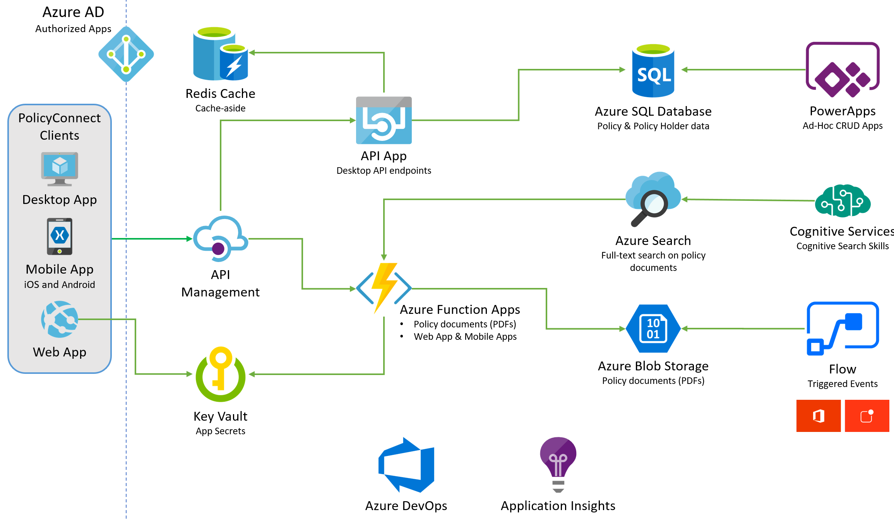

Information in this document, including URL and other Internet Web site references, is subject to change without notice. Unless otherwise noted, the example companies, organizations, products, domain names, e-mail addresses, logos, people, places, and events depicted herein are fictitious, and no association with any real company, organization, product, domain name, e-mail address, logo, person, place or event is intended or should be inferred. Complying with all applicable copyright laws is the responsibility of the user. Without limiting the rights under copyright, no part of this document may be reproduced, stored in or introduced into a retrieval system, or transmitted in any form or by any means (electronic, mechanical, photocopying, recording, or otherwise), or for any purpose, without the express written permission of Microsoft Corporation.

Microsoft may have patents, patent applications, trademarks, copyrights, or other intellectual property rights covering subject matter in this document. Except as expressly provided in any written license agreement from Microsoft, the furnishing of this document does not give you any license to these patents, trademarks, copyrights, or other intellectual property.

The names of manufacturers, products, or URLs are provided for informational purposes only and Microsoft makes no representations and warranties, either expressed, implied, or statutory, regarding these manufacturers or the use of the products with any Microsoft technologies. The inclusion of a manufacturer or product does not imply endorsement of Microsoft of the manufacturer or product. Links may be provided to third party sites. Such sites are not under the control of Microsoft and Microsoft is not responsible for the contents of any linked site or any link contained in a linked site, or any changes or updates to such sites. Microsoft is not responsible for webcasting or any other form of transmission received from any linked site. Microsoft is providing these links to you only as a convenience, and the inclusion of any link does not imply endorsement of Microsoft of the site or the products contained therein.

© 2019 Microsoft Corporation. All rights reserved.

Microsoft and the trademarks listed at <https://www.microsoft.com/en-us/legal/intellectualproperty/Trademarks/Usage/General.aspx> are trademarks of the Microsoft group of companies. All other trademarks are property of their respective owners.

**Contents**

<!-- TOC -->

- [App modernization Hackathon Challenge](#app-modernization-hackathon-challenge)
  - [Abstract and learning objectives](#abstract-and-learning-objectives)
  - [Overview](#overview)
  - [Solution architecture](#solution-architecture)
  - [Requirements](#requirements)
  - [Exercise 1: Migrate the on-premises database to Azure SQL Database](#exercise-1-migrate-the-on-premises-database-to-azure-sql-database)
    - [Task 1: Configure the ContosoInsurance database on the SqlServer2008 VM](#task-1-configure-the-contosoinsurance-database-on-the-sqlserver2008-vm)
    - [Task 2: Perform assessment for migration to Azure SQL Database](#task-2-perform-assessment-for-migration-to-azure-sql-database)
    - [Task 3: Migrate the database schema using the Data Migration Assistant](#task-3-migrate-the-database-schema-using-the-data-migration-assistant)
    - [Task 4: Retrieve SQL Server 2008 VM IP address](#task-4-retrieve-sql-server-2008-vm-ip-address)
    - [Task 5: Migrate the database using the Azure Database Migration Service](#task-5-migrate-the-database-using-the-azure-database-migration-service)
  - [Exercise 2: Post upgrade database enhancements](#exercise-2-post-upgrade-database-enhancements)
    - [Task 1: Configure SQL Data Discovery and Classification](#task-1-configure-sql-data-discovery-and-classification)
    - [Task 2: Review Advanced Data Security Vulnerability Assessment](#task-2-review-advanced-data-security-vulnerability-assessment)
    - [Task 3: Enable Dynamic Data Masking](#task-3-enable-dynamic-data-masking)
  - [Exercise 3: Configure Key Vault](#exercise-3-configure-key-vault)
    - [Task 1: Add Key Vault access policy](#task-1-add-key-vault-access-policy)
    - [Task 2: Create a new secret to store the SQL connection string](#task-2-create-a-new-secret-to-store-the-sql-connection-string)
    - [Task 3: Create a service principal](#task-3-create-a-service-principal)
    - [Task 4: Assign the service principal access to Key Vault](#task-4-assign-the-service-principal-access-to-key-vault)
  - [Exercise 4: Deploy Web API into Azure App Services](#exercise-4-deploy-web-api-into-azure-app-services)
    - [Task 1: Connect to the VM](#task-1-connect-to-the-vm)
    - [Task 2: Open starter solution with Visual Studio](#task-2-open-starter-solution-with-visual-studio)
    - [Task 3: Update Web API to use Key Vault](#task-3-update-web-api-to-use-key-vault)
    - [Task 4: Copy KeyVault configuration section to API App in Azure](#task-4-copy-keyvault-configuration-section-to-api-app-in-azure)
    - [Task 5: Deploy the API to Azure](#task-5-deploy-the-api-to-azure)
  - [Exercise 5: Deploy web application into Azure App Services](#exercise-5-deploy-web-application-into-azure-app-services)
    - [Task 1: Add API App URL to Web App Application settings](#task-1-add-api-app-url-to-web-app-application-settings)
    - [Task 2: Deploy web application to Azure](#task-2-deploy-web-application-to-azure)
  - [Exercise 6: Upload policy documents into blob storage](#exercise-6-upload-policy-documents-into-blob-storage)
    - [Task 1: Create container for storing PDFs in Azure storage](#task-1-create-container-for-storing-pdfs-in-azure-storage)
    - [Task 2: Create a SAS token](#task-2-create-a-sas-token)
    - [Task 3: Bulk upload PDFs to blob storage using AzCopy](#task-3-bulk-upload-pdfs-to-blob-storage-using-azcopy)
  - [Exercise 7: Create serverless API for accessing PDFs](#exercise-7-create-serverless-api-for-accessing-pdfs)
    - [Task 1: Add application settings to your Function App](#task-1-add-application-settings-to-your-function-app)
    - [Task 2: Add project environment variables](#task-2-add-project-environment-variables)
    - [Task 3: Create an Azure Function in Visual Studio](#task-3-create-an-azure-function-in-visual-studio)
    - [Task 4: Test the function locally](#task-4-test-the-function-locally)
    - [Task 5: Deploy the function to your Azure Function App](#task-5-deploy-the-function-to-your-azure-function-app)
    - [Task 6: Enable Application Insights on the Function App](#task-6-enable-application-insights-on-the-function-app)
    - [Task 7: Add Function App URL to your Web App Application settings](#task-7-add-function-app-url-to-your-web-app-application-settings)
  - [Exercise 8: Import and publish APIs into APIM](#exercise-8-import-and-publish-apis-into-apim)
    - [Task 1: Import API App](#task-1-import-api-app)
    - [Task 2: Import Function App](#task-2-import-function-app)
    - [Task 3: Open Developer Portal and retrieve you API key](#task-3-open-developer-portal-and-retrieve-you-api-key)
    - [Task 4: Update Web App to use API Management Endpoints](#task-4-update-web-app-to-use-api-management-endpoints)
  - [Exercise 9: Create an app in PowerApps](#exercise-9-create-an-app-in-powerapps)
    - [Task 1: Sign up for a PowerApps account](#task-1-sign-up-for-a-powerapps-account)
    - [Task 2: Create new SQL connection](#task-2-create-new-sql-connection)
    - [Task 3: Create a new app](#task-3-create-a-new-app)
    - [Task 4: Design app](#task-4-design-app)
    - [Task 5: Edit the app settings and run the app](#task-5-edit-the-app-settings-and-run-the-app)
  - [After the Hack](#after-the-hands-on-hack)
    - [Task 1: Delete Azure resource groups](#task-1-delete-azure-resource-groups)
    - [Task 2: Delete the contoso-apps service principal](#task-2-delete-the-contoso-apps-service-principal)

<!-- /TOC -->

# App modernization hackathon challenge

## Abstract and learning objectives

In this hack challenge, you implement the steps to modernize a legacy on-premises application, including upgrading and migrating the database to Azure and updating the application to take advantage of serverless and cloud services.

At the end of this hack challenge, your ability to build solutions for modernizing legacy on-premises applications and infrastructure using cloud services will be improved.

## Overview

Contoso, Ltd. (Contoso) is a new company in an old business. Founded in Auckland, NZ, in 2011, they provide a full range of long-term insurance services to help individuals who are under-insured, filling a void their founders saw in the market. From the beginning, they grew faster than anticipated and have struggled to cope with rapid growth. During their first year alone, they added over 100 new employees to keep up with the demand for their services. To manage policies and associated documentation, they use a custom-developed Windows Forms application, called PolicyConnect. PolicyConnect uses an on-premises SQL Server 2008 R2 database as its data store, along with a file server on its local area network for storing policy documents. That application and its underlying processes for managing policies have become increasingly overloaded.

Contoso recently started new web and mobile projects to allow policyholders, brokers, and employees to access policy information without requiring a VPN connection into the Contoso network. The web project is a new .NET Core 2.2 MVC web application, which accesses the PolicyConnect database using REST APIs. They eventually intend to share the REST APIs across all their applications, including the mobile app and WinForms version of PolicyConnect. They have a prototype of the web application running on-premises and are interested in taking their modernization efforts a step further by hosting the app in the cloud. However, they don't know how to take advantage of all the managed services of the cloud since they have no experience with it. They would like some direction converting what they have created so far into a more cloud-native application.

They have not started the development of a mobile app yet. Contoso is looking for guidance on how to take a .NET developer-friendly approach to implement the PolicyConnect mobile app on Android and iOS.

To prepare for hosting their applications in the cloud, they would like to migrate their SQL Server database to a PaaS SQL service in Azure. Contoso is hoping to take advantage of the advanced security features available in a fully-managed SQL service in the Azure. By migrating to the cloud, they hope to improve their technological capabilities and take advantage of enhancements and services that are enabled by moving to the cloud. The new features they would like to add are automated document forwarding from brokers, secure access for brokers, access to policy information, and reliable policy retrieval for a dispersed workforce. They have been clear that they will continue using the PolicyConnect WinForms application on-premises, but want to update the application to use cloud-based APIs and services. Additionally, they want to store policy documents in cloud storage for retrieval via the web and mobile apps.

## Solution architecture

Below is a high-level architecture diagram of the solution you implement in this hack challenge. Please review this carefully, so you understand the whole of the solution as you are working on the various components.



The solution begins with migrating Contoso's SQL Server 2008 R2 database to Azure SQL Database using the Azure Database Migration Service (DMS). Using the Data Migration Assistant (DMA) assessment, Contoso determined that they can migrate into a fully-managed SQL database service in Azure. The assessment revealed no compatibility issues or unsupported features that would prevent them from using Azure SQL Database. Next, they deploy the web and API apps into Azure App Services. Also, mobile apps, built for Android and iOS using Xamarin, are created to provide remote access to PolicyConnect. The website, hosted in a Web App, provides the user interface for browser-based clients, whereas the Xamarin Forms-based app provides the UI for mobile devices. Both the mobile app and website rely on web services hosted in a Function App, which sits behind API Management. An API App is also deployed to host APIs for the legacy Windows Forms desktop application. Light-weight, serverless APIs are provided by Azure Functions and Azure Functions Proxies to provide access to the database and policy documents stored in Blob Storage.

Azure API Management is used to create an API Store for development teams and affiliated partners. Sensitive configuration data, like connection strings, are stored in Key Vault and accessed from the APIs or Web App on demand so that these settings never live in their file system. The API App implements the cache aside pattern using Azure Redis Cache. A full-text cognitive search pipeline is used to index policy documents in Blob Storage. Cognitive Services are used to enable search index enrichment using cognitive skills in Azure Search. PowerApps is used to enable authorized business users to build mobile, and web create, read, update, delete (CRUD) applications. These apps interact with SQL Database and Azure Storage. Microsoft Flow enables them to orchestrations between services such as Office 365 email and services for sending mobile notifications. These orchestrations can be used independently of PowerApps or invoked by PowerApps to provide additional logic. The solution uses user and application identities maintained in Azure AD.

> **Note:** The solution provided is only one of many possible, viable approaches.

## Requirements

- Microsoft Azure subscription must be pay-as-you-go or MSDN.
  - Trial subscriptions will not work.
- A virtual machine configured with Visual Studio Community 2019 or higher (setup in the Before the hack exercises)
- **IMPORTANT**: To complete this challenge, you must have sufficient rights within your Azure AD tenant to:
  - Create an Azure Active Directory application and service principal
  - Assign roles on your subscription
  - Register resource providers

## Exercise 1: Migrate the on-premises database to Azure SQL Database

Duration: 45 minutes

In this exercise, you use the Microsoft Data Migration Assistant (DMA) to assess the `ContosoInsurance` database for a migration to Azure SQL Database. The assessment generates a report detailing any feature parity and compatibility issues between the on-premises database and Azure SQL Database.

> DMA helps you upgrade to a modern data platform by detecting compatibility issues that can impact database functionality on your new version of SQL Server or Azure SQL Database. DMA recommends performance and reliability improvements for your target environment and allows you to move your schema, data, and uncontained objects from your source server to your target server. To learn more, read the [Data Migration Assistant documentation](https://docs.microsoft.com/sql/dma/dma-overview?view=azuresqldb-mi-current).

### Task 1: Configure the ContosoInsurance database on the SqlServer2008 VM

Before you begin the assessment, you need to configure the `ContosoInsurance` database in your SQL Server 2008 R2 instance. In this task, you execute a SQL script against the `ContosoInsurance` database onto the SQL Server 2008 R2 instance.

> **Note**: There is a known issue with screen resolution when using an RDP connection to Windows Server 2008 R2 which may affect some users. This issue presents itself as very small, hard to read text on the screen. The workaround for this is to use a second monitor for the RDP display, which should allow you to scale up the resolution to make the text larger.


  Code Reference:
  
    ```sql
    USE master;
    GO

    -- SET the sa password
    ALTER LOGIN [sa] WITH PASSWORD=N'Password.1!!';
    GO

    -- Enable Mixed Mode Authentication
    EXEC xp_instance_regwrite N'HKEY_LOCAL_MACHINE',
    N'Software\Microsoft\MSSQLServer\MSSQLServer', N'LoginMode', REG_DWORD, 2;
    GO

    -- Create a login and user named WorkshopUser
    CREATE LOGIN WorkshopUser WITH PASSWORD = N'Password.1!!';
    GO

    EXEC sp_addsrvrolemember
        @loginame = N'WorkshopUser',
        @rolename = N'sysadmin';
    GO

    USE ContosoInsurance;
    GO

    IF NOT EXISTS (SELECT * FROM sys.database_principals WHERE name = N'WorkshopUser')
    BEGIN
        CREATE USER [WorkshopUser] FOR LOGIN [WorkshopUser]
        EXEC sp_addrolemember N'db_datareader', N'WorkshopUser'
    END;
    GO

    -- Update the recovery model of the database to FULL
    ALTER DATABASE ContosoInsurance SET RECOVERY FULL;
    GO
    ```


### Task 2: Perform assessment for migration to Azure SQL Database

Contoso would like an assessment to see what potential issues they might need to address in moving their database to Azure SQL Database. In this task, you use the [Microsoft Data Migration Assistant](https://docs.microsoft.com/en-us/sql/dma/dma-overview?view=sql-server-2017) (DMA) to perform an assessment of the `ContosoInsurance` database against Azure SQL Database (Azure SQL DB). Data Migration Assistant (DMA) enables you to upgrade to a modern data platform by detecting compatibility issues that can impact database functionality on your new version of SQL Server or Azure SQL Database. It recommends performance and reliability improvements for your target environment. The assessment generates a report detailing any feature parity and compatibility issues between the on-premises database and the Azure SQL DB service.

> **Note**: The Database Migration Assistant has already been installed on your SqlServer2008 VM. It can also be downloaded from the [Microsoft Download Center](https://www.microsoft.com/en-us/download/details.aspx?id=53595).


  Reference: 
  
   - **Username**: Enter **WorkshopUser**
   - **Password**: Enter **Password.1!!**
   - **Encrypt connection**: Check this box.
   - **Trust server certificate**: Check this box.
  
> The DMA assessment for a migrating the `ContosoInsurance` database to a target platform of Azure SQL DB reveals that there are no issues or features preventing Contoso from migrating their database to Azure SQL DB. You can select **Export Assessment** at the top right to save the report as a JSON file, if desired.


### Task 3: Migrate the database schema using the Data Migration Assistant

After you have reviewed the assessment results and you have ensured the database is a candidate for migration to Azure SQL Database, use the Data Migration Assistant to migrate the schema to Azure SQL Database.


  Reference (source):
  
   - **Username**: Enter **WorkshopUser**
   - **Password**: Enter **Password.1!!**

Reference (target):
   - **Username**: Enter **demouser**
   - **Password**: Enter **Password.1!!**

Reference (SSMS):
    - **Server name**: Paste the server name of your Azure SQL Database you copied above.
    - **Authentication type**: Select SQL Server Authentication.
    - **Username**: Enter **demouser**
    - **Password**: Enter **Password.1!!**
    - **Remember password**: Check this box.


### Task 4: Retrieve SQL Server 2008 VM IP address

In this task, you use the Azure Cloud shell to retrieve the IP address of the SqlServer2008 VM, which is needed to connect to your SqlServer2008 VM from DMS.


  Reference:
  
    ```powershell
    az vm list-ip-addresses -g hackathon-SUFFIX -n SqlServer2008 --output table
    ```

    > **Note**: If you have multiple Azure subscriptions, and the account you are using for this hack is not your default account, you may need to run `az account list --output table` at the Azure Cloud Shell prompt to output a list of your subscriptions, then copy the Subscription Id of the account you are using for this hack, and then run `az account set --subscription <your-subscription-id>` to set the appropriate account for the Azure CLI commands.
	
    ```powershell
    az sql server list -g hackathon-SUFFIX
    ```
    Copy the **fullyQualifiedDomainName** value into a text editor for use below.


### Task 5: Migrate the database using the Azure Database Migration Service

At this point, you have migrated the database schema using DMA. In this task, you migrate the data from the `ContosoInsurance` database into the new Azure SQL Database using the Azure Database Migration Service.

> The [Azure Database Migration Service](https://docs.microsoft.com/en-us/azure/dms/dms-overview) integrates some of the functionality of Microsoft existing tools and services to provide customers with a comprehensive, highly available database migration solution. The service uses the Data Migration Assistant to generate assessment reports that provide recommendations to guide you through the changes required prior to performing a migration. When you're ready to begin the migration process, Azure Database Migration Service performs all of the required steps.

Reference (source):

    - **Username**: Enter **WorkshopUser**
    - **Password**: Enter **Password.1!!**
    - **Connection properties**: Check both Encrypt connection and Trust server certificate.

Reference (target):
    - **Username**: Enter **demouser**
    - **Password**: Enter **Password.1!!**
    - **Connection properties**: Check Encrypt connection.


    - **Activity name**: Enter ContosoDataMigration.


## Exercise 2: Post upgrade database enhancements

Duration: 30 minutes

In this exercise you explore some of the security features of Azure SQL Database, and review some of the security benefits that come with running your database in Azure. [SQL Database Advance Data Security](https://docs.microsoft.com/azure/sql-database/sql-database-advanced-data-security) (ADS) provides advanced SQL security capabilities, including functionality for discovering and classifying sensitive data, surfacing and mitigating potential database vulnerabilities, and detecting anomalous activities that could indicate a threat to your database.

> **Note**: Advanced Data Security was enabled on the database with the ARM template, so you do not need to do that here.

### Task 1: Configure SQL Data Discovery and Classification

In this task, you look at the [SQL Data Discovery and Classification](https://docs.microsoft.com/sql/relational-databases/security/sql-data-discovery-and-classification?view=sql-server-2017) feature of Advanced Data Security. Data Discovery & Classification introduces a new tool for discovering, classifying, labeling & reporting the sensitive data in your databases. It introduces a set of advanced services, forming a new SQL Information Protection paradigm aimed at protecting the data in your database, not just the database. Discovering and classifying your most sensitive data (business, financial, healthcare, etc.) can play a pivotal role in your organizational information protection stature.


### Task 2: Review Advanced Data Security Vulnerability Assessment

In this task, you review an assessment report generated by ADS for the `ContosoInsurance` database. The [SQL Vulnerability Assessment service](https://docs.microsoft.com/azure/sql-database/sql-vulnerability-assessment) is a service that provides visibility into your security state, and includes actionable steps to resolve security issues, and enhance your database security.


### Task 3: Enable Dynamic Data Masking

In this task, you enable [Dynamic Data Masking](https://docs.microsoft.com/sql/relational-databases/security/dynamic-data-masking?view=sql-server-ver15) (DDM) into your Azure SQL Database to limit access to sensitive data in the database through query results. This feature helps prevent unauthorized access to sensitive data by enabling customers to designate how much of the sensitive data to reveal with minimal impact on the application layer. It’s a policy-based security feature that hides the sensitive data in the result set of a query over designated database fields, while the data in the database is not changed.

> For example, a service representative at a call center may identify callers by several digits of their credit card number, but those data items should not be fully exposed to the service representative. A masking rule can be defined that masks all but the last four digits of any credit card number in the result set of any query. As another example, an appropriate data mask can be defined to protect personally identifiable information (PII) data, so that a developer can query production environments for troubleshooting purposes without violating compliance regulations.

Reference (DB Engine):
    - **Server name**: Paste the server name of your Azure SQL Database, as you've done previously.
    - **Authentication type**: Select SQL Server Authentication.
    - **Username**: Enter **demouser**
    - **Password**: Enter **Password.1!!**
    - **Remember password**: Check this box.

Reference (Query):
   ```sql
   USE [ContosoInsurance];
   GO

   CREATE USER DDMUser WITHOUT LOGIN;
   GRANT SELECT ON [dbo].[people] TO DDMUser;
   ```

    ```sql
    USE [ContosoInsurance];
    GO

    EXECUTE AS USER = 'DDMUser';
    SELECT * FROM [dbo].[people];
    REVERT;
    ```


## Exercise 3: Configure Key Vault

Duration: 15 minutes

As part of their efforts to put tighter security controls in place, Contoso has requested that application secrets to be stored in a secure manner, so they aren't visible in plain text in application configuration files. In this exercise, you configure Azure Key Vault, which securely stores application secrets for the Contoso web and API applications, once migrated to Azure.

### Task 1: Add Key Vault access policy

In this task, you add an access policy to Key Vault to allow secrets to be created with your account.


### Task 2: Create a new secret to store the SQL connection string

In this task, you add a secret to Key Vault containing the connection string for the `ContosoInsurance` Azure SQL database.


### Task 3: Create a service principal

In this task, you use the Azure Cloud Shell and Azure Command Line Interface (CLI) to create an Azure Active Directory (Azure AD) application and service principal (SP) used to provide your web and API apps access to secrets stored in Azure Key Vault.

> **Important**: You must have rights within your Azure AD tenant to create applications and assign roles to complete this task.


  Reference: 
  

    ```powershell
    az account list --output table
    ```

    > **Note**: If you have multiple Azure subscriptions, and the account you are using for this hack is not your default account, you may need to run `az account set --subscription <your-subscription-id>` after running the command above to set the appropriate account for the following Azure CLI commands, replacing `<your-subscription-id>` with the appropriate value from the output list above.


  Reference: 
  

    ```powershell
    $subscriptionId = "<your-subscription-id>"
    $resourceGroup = "<your-resource-group-name>"
    az ad sp create-for-rbac -n "contoso-apps" --role reader --scopes subscriptions/$subscriptionId/resourceGroups/$resourceGroup
    ```
  Reference:
  

    ```json
    {
        "appId": "94ee2739-794b-4038-a378-573a5f52918c",
        "displayName": "contoso-apps",
        "name": "http://contoso-apps",
        "password": "b9a3a8b7-574d-467f-8cae-d30d1d1c1ac4",
        "tenant": "d280491c-b27a-XXXX-XXXX-XXXXXXXXXXXX"
    }
    ```

    > **Important**: Make sure you copy the output into a text editor, as the Azure Cloud Shell session eventually times out, and you won't have access to the output. The `appId` is used in the steps below to assign an access policy to Key Vault, and both the `appId` and `password` are used in the next exercise to add the configuration values to the web and API apps to allow them to read secrets from Key Vault.


### Task 4: Assign the service principal access to Key Vault

In this task, you assign the service principal you created above to a reader role on your resource group and add an access policy to Key Vault to allow it to view secrets stored there.

  Reference:
  

    ```powershell
    az keyvault list -g <your-resource-group-name> --output table
    ```

Reference:

    ```powershell
    az keyvault set-policy -n <your-key-vault-name> --spn http://contoso-apps --secret-permissions get list
    ```

## Exercise 4: Deploy Web API into Azure App Services

Duration: 45 minutes

The developers at Contoso have been working toward migrating their apps to the cloud, and they have provided you with a starter solution developed using ASP.NET Core 2.2. As such, most of the pieces are already in place to deploy the apps to Azure, as well as configure them to communicate with the new app services. Since the required services have already been provisioned, what remains is to integrate Azure Key Vault into the API, apply application-level configuration settings, and then deploy the apps from the Visual Studio starter solution. In this task, you apply application settings to the Web API using the Azure Portal. Once the application settings have been set, you deploy the Web App and API App into Azure from Visual Studio.

### Task 1: Connect to the VM

In this task, you open an RDP connection to the VM, and downloading a copy of the starter solution provided by Contoso. The application deployments are handled using Visual Studio 2019, installed on the VM.

  Reference: 

   - **Username**: demouser
   - **Password**: Password.1!!


### Task 2: Open starter solution with Visual Studio

In this task, you open the `Contoso` starter solution in Visual Studio. The Visual Studio solution contains the following projects:

- **Contoso.Azure**: Common library containing helper classes used by other projects within the solution to communicate with Azure services.
- **Contoso.Data**: Library containing data access objects.
- **Contoso.FunctionApp**: Contains an Azure Function that is used to retrieve policy documents from Blob storage.
- **Contoso.Web**: ASP.NET Core 2.2 PolicyConnect web application.
- **Contoso.WebApi**: ASP.NET Core 2.2 Web API used by the web application to communicate with the database.

In File Explorer, navigate to and double-click the `Contoso.sln` file.


### Task 3: Update Web API to use Key Vault

In this task, you update the `Contoso.WebApi` project to use Azure Key Vault for storing and retrieving application secrets. You start by adding the connection information to the `appsettings.json` file in the `Contoso.WebApi` project, and then add some code to enable the use of Azure Key Vault.

> The required NuGet package to enable interaction with Key Vault has already been referenced in the project to save time. The package added to facilitate this is: `Microsoft.Extensions.Configuration.AzureKeyVault`.


### Task 4: Copy KeyVault configuration section to API App in Azure

Before deploying the Web API to Azure, you need to add the required application settings into the configuration for the Azure API App. In this task, you use the advanced configuration editor in your API App to add in the configuration settings required to connect to and retrieve secrets from Key Vault.

  Reference:

    ```json
    [
        {
            "name": "KeyVaultName",
            "value": "<your-key-vault-name>"
        },
        {
            "name": "KeyVaultClientId",
            "value": "<your-service-principal-application-id>"
        },
        {
            "name": "KeyVaultClientSecret",
            "value": "<your-service-principal-password>"
        }
    ]
    ```


### Task 5: Deploy the API to Azure

In this task, you use Visual Studio to deploy the API project into an API App in Azure.

  Reference: 
  
To validate the API App is function property, add `/swagger` to the end of the URL in your browser's address bar (e.g., <https://contoso-api-jjbp34uowoybc.azurewebsites.net/swagger/>). This brings up the Swagger UI page of your API, which displays a list of the available API endpoints.

    > **Note**: [Swagger UI](https://swagger.io/tools/swagger-ui/) automatically generates visual documentation for REST APIs following the OpenAPI Specification. It makes it easy for developers to visualize and interact with the API's endpoints without having any of the implementation logic in place.

Reference:

    ```powershell
    az webapp list -g <your-resource-group-name> --output table
    ```

    > **Note**: If you have multiple Azure subscriptions, and the account you are using for this hackathon is not your default account, you may need to run `az account list --output table` at the Azure Cloud Shell prompt to output a list of your subscriptions, then copy the Subscription Id of the account you are using for this hack, and then run `az account set --subscription <your-subscription-id>` to set the appropriate account for the Azure CLI commands.

Reference:

    ```powershell
    $webAppName = "<your-web-app-name>"
    $defaultHostName = "<your-api-default-host-name>"
    $resourceGroup = "<your-resource-group-name>"
    az webapp config appsettings set -n $webAppName -g $resourceGroup --settings "ApiUrl=https://$defaultHostName"
    ```


### Task 2: Deploy web application to Azure

In this task, you publish the `Contoso.Web` application into an Azure Web App.


## Exercise 6: Upload policy documents into blob storage

Duration: 10 minutes.

Contoso is currently storing all of their scanned PDF documents on a shared local network. They have asked to be able to store them in the cloud automatically from a workflow. In this exercise, you provide a storage account to store the files in a blob container. Then, you provide a way to bulk upload their existing PDFs.

### Task 1: Create container for storing PDFs in Azure storage

In this task, you create a new blob container in your storage account for the scanned PDF policy documents.


### Task 2: Create a SAS token

In this task, you generate a shared access signature (SAS) token for your storage account. This is used later in the hack to allow your Azure Function to retrieve files from the `policies` storage account container.


### Task 3: Bulk upload PDFs to blob storage using AzCopy

In this task, you download and install [AzCopy](https://docs.microsoft.com/en-us/azure/storage/common/storage-use-azcopy). You then use AzCopy to copy the PDF files from the "on-premises" location into the policies container in Azure storage.

  Reference:
  
<https://aka.ms/downloadazcopy>.

`C:\Program Files (x86)\Microsoft SDKs\Azure\AzCopy` (On a 32-bit machine, change `Program Files (x86)` to `Program Files` ).

   ```bash
   cd C:\Program Files (x86)\Microsoft SDKs\Azure\AzCopy
   ```

   ```bash
   AzCopy /Source:"[FILE-SOURCE]" /Dest:"[STORAGE-CONTAINER-URL]" /DestKey:"[STORAGE-ACCOUNT-KEY]" /S
   ```

    ```bash
    AzCopy /Source:"C:\.\.\....\lab-files\policy-documents" /Dest:"https://contosojt7yc3zphxfda.blob.core.windows.net/policies" /DestKey:"XJT3us2KT1WQHAQBbeotrRCWQLZayFDNmhLHt3vl2miKOHeXasB7IUlw2+y4afH6R/03wbTiRK9SRqGXt9JVqQ==" /S
    ```


## Exercise 7: Create serverless API for accessing PDFs

Duration: 30 minutes

Contoso has made some updates to prepare their applications, but there are some features that they have not been able to build into the API yet. They have requested that you assist them in setting up a proof-of-concept (POC) API solution to enable users of their application to retrieve their policy documents directly from their Azure Storage account. In this exercise, you create an Azure Function to enable this functionality using serverless technologies.

### Task 1: Add application settings to your Function App

In this task, you prepare your Azure Function App to work with your new Function by adding your storage account policies container URL and SAS token values to the Application Settings of your Function App, using the Azure Cloud Shell and Azure CLI.

  Reference:
  

    ```powershell
    az functionapp list -g <your-resource-group-name> --output table
    ```

    > **Note**: If you have multiple Azure subscriptions, and the account you are using for this hack is not your default account, you may need to run `az account list --output table` at the Azure Cloud Shell prompt to output a list of your subscriptions, then copy the Subscription Id of the account you are using for this hack, and then run `az account set --subscription <your-subscription-id>` to set the appropriate account for the Azure CLI commands.


    ```powershell
    $functionAppName = "<your-function-app-name>"
    $resourceGroup = "<your-resource-group-name>"
    $storageUrl = "<your-policies-container-url>"
    $storageSas = "<your-storage-account-sas-token>"
    az functionapp config appsettings set -n $functionAppName -g $resourceGroup --settings "PolicyStorageUrl=$storageUrl" "PolicyStorageSas=$storageSas"
    ```


### Task 2: Add project environment variables

Functions use environment variables to retrieve configuration settings. To test your functions locally, you must add these settings as user environment variables on your development machine or to the project settings.

In this task, you create some environment variables on your VM, which allows for debugging your Function App locally on the VM.


### Task 3: Create an Azure Function in Visual Studio

In this task, you use Visual Studio to create an Azure Function. This Function serves as a serverless API for retrieving policy documents from Blob storage.

  Reference:
  

    ```csharp
    [FunctionName("PolicyDocs")]
        public static async Task<IActionResult> Run(
                [HttpTrigger(AuthorizationLevel.Function, "get", Route = "policies/{policyHolder}/{policyNumber}")] HttpRequest req, string policyHolder, string policyNumber, ILogger log)
    ```

    > **Note**: Notice that in the code you removed `"post"` from the list of acceptable verbs, and then updated the Route of the HttpTrigger from `null` to `policies/{policyHolder}/{policyNumber}`. This allows for the function to be parameterized. You then added `string` parameters to the Run method to allow those parameters to be received and used within the function.

Reference
    ```csharp
    var containerUri = Environment.GetEnvironmentVariable("PolicyStorageUrl");
    var sasToken = Environment.GetEnvironmentVariable("PolicyStorageSas");
    ```

    > **Note**: When the API is deployed to an Azure API App, `Environment.GetEnvironmentVariables()` looks for the specified values in the configured application settings.


### Task 4: Test the function locally

In this task, you run your Function locally through the Visual Studio debugger, to verify that it is properly configured and able to retrieve documents from the `policy` container in your Storage account.

> **IMPORTANT**: Internet Explorer on Windows Server 2008 R2 does not include functionality to open PDF documents. To view the downloaded policy documents in this task, you need to [download and install the Chrome browser](https://www.google.com/chrome/) on your VM.

  Reference: 
  

    ```http
    http://localhost:7071/api/policies/{policyHolder}/{policyNumber}
    ```


    ```http
    http://localhost:7071/api/policies/Acevedo/ACE5605VZZ2ACQ
    ```


### Task 5: Deploy the function to your Azure Function App

In this task, you deploy your function into an Azure Function App, where the web application uses it to retrieve policy documents.


### Task 6: Enable Application Insights on the Function App

In this task, you add Application Insights to your Function App in the Azure Portal, to be able to collect insights into requests against the Function.


### Task 7: Add Function App URL to your Web App Application settings

In this task, you add the URL of your Azure Function App to the Application settings configuration of your Web App.

  Reference: 
  

    ```powershell
    az functionapp list -g <your-resource-group-name> --output table
   ```

    > **Note**: If you have multiple Azure subscriptions, and the account you are using for this hackathon is not your default account, you may need to run `az account list --output table` at the Azure Cloud Shell prompt to output a list of your subscriptions, then copy the Subscription Id of the account you are using for this hack, and then run `az account set --subscription <your-subscription-id>` to set the appropriate account for the Azure CLI commands.

Reference: 

    ```powershell
    az webapp list -g <your-resource-group-name> --output table
    ```

Reference: 

    ```powershell
    $webAppName = "<your-web-app-name>"
    $defaultHostName = "<your-function-app-default-host-name>"
    $defaultHostKey = "<your-function-app-default-host-key>"
    $resourceGroup = "<your-resource-group-name>"
    az webapp config appsettings set -n $webAppName -g $resourceGroup --settings "PolicyDocumentsPath=https://$defaultHostName/api/policies/{policyHolder}/{policyNumber}?code=$defaultHostKey"
    ```


### Task 8: Test document retrieval from web app

In this task, you open the PolicyConnect web app and download a policy document. Recall from above that this resulted in a page not found error when you tried it previously.


### Task 9: View Live Metrics Stream


## Exercise 8: Add Cognitive Search for policy documents

Duration: 15 minutes

Contoso has requested the ability to perform full-text searching on policy documents. Previously, they have not been able to extract information from the documents in a usable way, but they have read about [cognitive search with Azure Search Service](https://docs.microsoft.com/en-us/azure/search/cognitive-search-concept-intro), and are interested to learn if it could be used to make the data in their search index more useful. In this exercise, you configure cognitive search for the policies blob storage container.

### Task 1: Add Azure Search to Storage account


### Task 2: Review search results

In this task, you run a query against your search index to review the enrichments added by cognitive search to policy documents.

Reference: 


   ```json
   {
        "@search.score": 1,
        "content": "\nContoso Insurance - Your Platinum Policy\n\nPolicy Holder: Igor Cooke\nPolicy #: COO13CE2ZLOKD\nEffective Coverage Dates: 22 July 2008 - 13 August 2041\nAddress: P.O. Box 442, 802 Pellentesque AveTaupo, NI 240\nPolicy Amount: $48,247.00\nDeductible: $250.00\nOut of Pocket Max: $1,000.00\n\nDEPENDENTS\nFirst Name Date of Birth\n\nIma 21 January 2002\nEcho 12 August 2003\n\nPage Summary\nDependents\n\n1 / 0 22 July 2008\n\n\nworksheet1\n\n\t\tFirst Name\t\tDate of Birth\n\n\t\tIma\t\t21 January 2002\n\n\t\tEcho\t\t12 August 2003\n\n\n\n\n\n\n",
        "metadata_storage_content_type": "application/octet-stream",
        "metadata_storage_size": 142754,
        "metadata_storage_last_modified": "2019-10-23T21:42:23Z",
        "metadata_storage_content_md5": "ksk3JZT5QPkHfAR0F17ZEw==",
        "metadata_storage_name": "Cooke-COO13CE2ZLOKD.pdf",
        "metadata_storage_path": "aHR0cHM6Ly9ob2xzdG9yYWdlYWNjb3VudC5ibG9iLmNvcmUud2luZG93cy5uZXQvcG9saWNpZXMvQ29va2UtQ09PMTNDRTJaTE9LRC5wZGY1",
        "metadata_content_type": "application/pdf",
        "metadata_language": "en",
        "metadata_author": "Contoso Insurance",
        "metadata_title": "Your Policy",
        "People": [
            "Igor Cooke",
            "Cooke",
            "Max"
        ],
        "Organizations": [
            "Contoso Insurance - Your Platinum Policy",
            "NI",
            "DEPENDENTS\nFirst",
            "Ima",
            "Page Summary\nDependents",
            "Echo"
        ],
        "Locations": [],
        "Keyphrases": [
            "Platinum Policy",
            "Policy Holder",
            "Date of Birth",
            "Echo",
            "DEPENDENTS",
            "Ima",
            "Box",
            "Pellentesque AveTaupo",
            "Address",
            "NI",
            "Contoso Insurance",
            "Igor Cooke",
            "Effective Coverage Dates",
            "Pocket Max",
            "Page Summary",
            "COO13CE2ZLOKD",
            "worksheet1"
        ],
        "Language": "en",
        "Translated_Text": "\nContoso Insurance - Your Platinum Policy\n\nPolicy Holder: Igor Cooke\nPolicy #: COO13CE2ZLOKD\nEffective Coverage Dates: 22 July 2008 - 13 August 2041\nAddress: P.O. Box 442, 802 Pellentesque AveTaupo, NI 240\nPolicy Amount: $48,247.00\nDeductible: $250.00\nOut of Pocket Max: $1,000.00\n\nDEPENDENTS\nFirst Name Date of Birth\n\nIma 21 January 2002\nEcho 12 August 2003\n\nPage Summary\nDependents\n\n1 / 0 22 July 2008\n\nworksheet1\n\nFirst Name\t\tDate of Birth\n\nIma\t\t21 January 2002\n\nEcho\t\t12 August 2003\n\n"
   }
   ```

Reference: 

   ```json
   {
        "@search.score": 1,
        "content": "\nContoso Insurance - Your Platinum Policy\n\nPolicy Holder: Igor Cooke\nPolicy #: COO13CE2ZLOKD\nEffective Coverage Dates: 22 July 2008 - 13 August 2041\nAddress: P.O. Box 442, 802 Pellentesque AveTaupo, NI 240\nPolicy Amount: $48,247.00\nDeductible: $250.00\nOut of Pocket Max: $1,000.00\n\nDEPENDENTS\nFirst Name Date of Birth\n\nIma 21 January 2002\nEcho 12 August 2003\n\nPage Summary\nDependents\n\n1 / 0 22 July 2008\n\n\nworksheet1\n\n\t\tFirst Name\t\tDate of Birth\n\n\t\tIma\t\t21 January 2002\n\n\t\tEcho\t\t12 August 2003\n\n\n\n\n\n\n",
        "metadata_storage_content_type": "application/octet-stream",
        "metadata_storage_size": 142754,
        "metadata_storage_last_modified": "2019-10-23T21:42:23Z",
        "metadata_storage_content_md5": "ksk3JZT5QPkHfAR0F17ZEw==",
        "metadata_storage_name": "Cooke-COO13CE2ZLOKD.pdf",
        "metadata_storage_path": "aHR0cHM6Ly9ob2xzdG9yYWdlYWNjb3VudC5ibG9iLmNvcmUud2luZG93cy5uZXQvcG9saWNpZXMvQ29va2UtQ09PMTNDRTJaTE9LRC5wZGY1",
        "metadata_content_type": "application/pdf",
        "metadata_language": "en",
        "metadata_author": "Contoso Insurance",
        "metadata_title": "Your Policy"
   }
   ```


## Exercise 8: Import and publish APIs into APIM

Duration: 30 minutes

In this exercise, you publish your API App and Function App API endpoints through API Management.

### Task 1: Import API App

In this task, you import your API App into APIM, using the OpenAPI specification, which leverages the Swagger definition associated with your API app.

  Reference: 
  
<https://contoso-api-jt7yc3zphxfda.azurewebsites.net/swagger>).

Reference: 
    ```xml
    <cors allow-credentials="true">
        <allowed-origins>
            <origin><your-web-app-url></origin>
        </allowed-origins>
        <allowed-methods>
            <method>*</method>
        </allowed-methods>
        <allowed-headers>
            <header>*</header>
        </allowed-headers>
        <expose-headers>
            <header>*</header>
        </expose-headers>
    </cors>
    ```

    > **Note**: The policy added above is for handling cross-origin resource sharing (CORS). If you are testing the web app locally, you need to add another `<origin></origin>` tag within `<allowed-origins></allowed-origins>` that contains `https://localhost:<port-number>`, where `<port-number>` is the port assigned by your debugger (as is shown in the screenshot above).


### Task 2: Import Function App

In this task, you import your Function App into APIM.


### Task 3: Open Developer Portal and retrieve you API key

In this task, you quickly look at the APIs in the Developer Portal, and retrieve your key. The Developer Portal allows you to check the list of APIs and endpoints as well as find useful information about them.


### Task 4: Update Web App to use API Management Endpoints

In this task, you use the Azure Cloud Shell and Azure CLI to update the `ApiUrl` and `PolicyDocumentsPath` settings for the PolicyConnect Web App. You also add a new setting for the APIM access key.

  Reference: 
  

    ```powershell
    az webapp list -g <your-resource-group-name> --output table
    ```

Reference: 

    ```powershell
    $webAppName = "<your-web-app-name>"
    $apimUrl = "<your-apim-url>"
    $apimKey = "<your-apim-subscription-key>"
    $policyDocsPath = "<your-apim-function-app-path>"
    $resourceGroup = "<your-resource-group-name>"
    az webapp config appsettings set -n $webAppName -g $resourceGroup --settings "PolicyDocumentsPath=$policyDocsPath" "ApiUrl=$apimUrl" "ApimSubscriptionKey=$apimKey"
    ```


## Exercise 9: Create an app in PowerApps

Duration: 15 minutes

Since creating mobile apps is a long development cycle, Contoso is interested in using PowerApps to create mobile applications to add functionality not currently offered by their app rapidly. In this scenario, they want to be able to edit the Policy lookup values (Silver, Gold, Platinum, etc.), which they are unable to do in the current app. In this task, you get them up and running with a new app created in PowerApps, which connects to the `ContosoInsurance` database and performs basic CRUD (Create, Read, Update, and Delete) operations against the Policies table.

### Task 1: Sign up for a PowerApps account

1. Go to <https://web.powerapps.com> and sign up for a new account, using the same account you have been using in Azure.

2. You may receive an email asking you to verify your account request, with a link to continue the process.

3. Download and install **PowerApps Studio** from the Microsoft store: <https://www.microsoft.com/en-us/store/p/powerapps/9nblggh5z8f3>.

> **Note**: If you are unable to install PowerApps on the VM, you can run install it on your local machine and run the steps for this exercise there.

### Task 2: Create new SQL connection

  Reference: 
  

   - **Authentication Type**: Select **SQL Server Authentication**.
   - **SQL Server name**: Enter the server name of your Azure SQL database. For example, `contosoinsurance-jjbp34uowoybc.database.windows.net`.
   - **SQL Database name**: Enter **ContosoInsurance**
   - **Username**: Enter **demouser**
   - **Password**: Enter **Password.1!!**


### Task 3: Create a new app

PowerApps Studio application


### Task 4: Design app


### Task 5: Edit the app settings and run the app


## After the Hack

Duration: 10 minutes

In this exercise, you de-provision all Azure resources that were created in support of this hack.

### Task 1: Delete Azure resource groups


### Task 2: Delete the contoso-apps service principal


You should follow all steps provided *after* attending the Hack.
